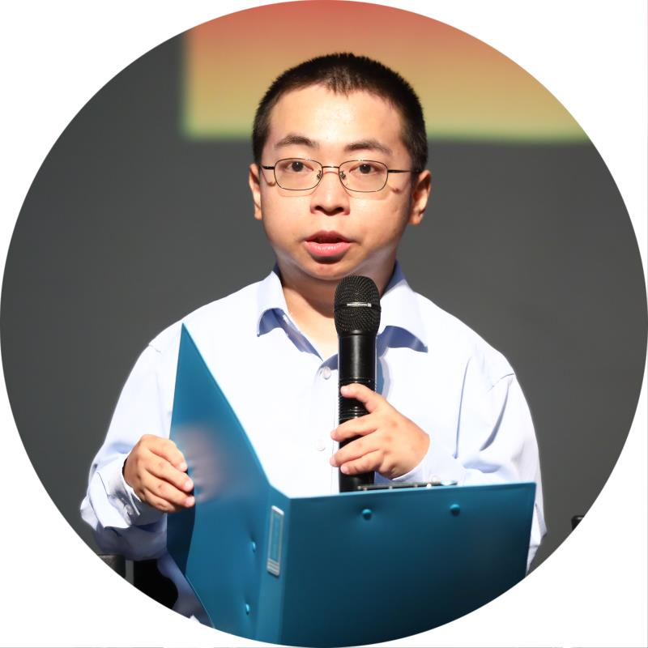

## Bio

Xiaoyuan Yi is a PhD Student at the Department of Computer Science and Technology, Tsinghua University. Xiaoyuan received his BS degree in 2016 from Tsinghua University. His research focuses on deep learning applied to natural language processing, automatic text generation and grammar error correction. He has published over 10 papers in important NLP/AI conferences including AAAI, IJCAI, ACL, EMNLP, CoNLL, CCL, etc.

Email: yi-xy16@mails.tsinghua.edu.cn

Address: FIT Building, Tsinghua University, Beijing, 100084

## Code and Systems

* [**Jiuge (九歌)**](http://jiuge.thunlp.org/): an online Chinese poetry generation system
* [**THUNLP-AIPoet**](https://github.com/THUNLP-AIPoet): open-source poetry generation models and resources

## Publications

* **Xiaoyuan Yi**, Zhenghao Liu, Wenhao Li and Maosong Sun. 2020. Text Style Transfer via Learning Style
Instance Supported Latent Space. In *Proceedings of IJCAI 2020*. **(CCF Rank A)** [[paper]](papers/ijcai20_styins.pdf)

* **Xiaoyuan Yi**, Ruoyu Li, Cheng Yang, Wenhao Li and Maosong Sun. 2020. MixPoet: Diverse Poetry
Generation via Learning Controllable Mixed Latent Space. In *Proceedings of AAAI 2020*. **(CCF Rank A)** [[paper]](papers/aaai20_mixpoet.pdf) [[slides]](slides/mixpoet.pdf) [[video in Chinese]](https://www.bilibili.com/video/BV1Sz4y1Q7WM)

* Zhipeng Guo, **Xiaoyuan Yi**, Maosong Sun, Wenhao Li, Cheng Yang, Jiannan Liang, Huimin Chen,
Yuhui Zhang and Ruoyu Li. 2019. Jiuge: A Human-Machine Collaborative Chinese Classical Poetry
Generation System. In *Proceedings of ACL 2019*. Demo Paper. **(Co-first Author, CCF Rank A)** [[paper]](papers/acl19_demo.pdf)

* Huimin Chen, **Xiaoyuan Yi**, Maosong Sun, Wenhao Li, Cheng Yang and Zhipeng Guo. 2019.
Sentiment-Controllable Chinese Poetry Generation. In *Proceedings of IJCAI 2019*. **(Co-first Author, CCF Rank A)** [[paper]](papers/ijcai19_sentiment.pdf)

* Jiannan Liang, Maosong Sun, **Xiaoyuan Yi**. 2019. Neural Network-Based Poetry Retrieval. In *Proceedings of the
Eighteenth Conference of Chinese Computational Linguistics (CCL 2019)*. (in Chinese) [[paper]](papers/ccl19_poetryir.pdf)

* Jiannan Liang, Maosong Sun, **Xiaoyuan Yi**, Cheng Yang, Huimin Chen and Zhenghao Liu. Neural Network-Based
Jiju Poetry Generation. 2019. In *Journal of Chinese Information processing*, 33 (3): 126–135. (in Chinese) [[paper]](papers/jiju.pdf)

* **Xiaoyuan Yi**, Maosong Sun, Ruoyu Li, and Wenhao Li. 2018. Automatic Poetry Generation with Mutual
Reinforcement Learning. In *Proceedings of EMNLP 2018*. **(CCF Rank B)** [[paper]](papers/emnlp18_mrl.pdf) [[slides]](slides/mrlpoetry.pdf) [[video]](https://vimeo.com/305925622)

* Cheng Yang, Maosong Sun, **Xiaoyuan Yi**, and Wenhao Li. 2018. Stylistic Chinese Poetry Generation via
Unsupervised Style Disentanglement. In *Proceedings of EMNLP 2018*. **(CCF Rank B)** [[paper]](papers/emnlp18_uspg.pdf)

* **Xiaoyuan Yi**, Ruoyu Li and Maosong Sun. 2018. Chinese Poetry Generation with a Salient-Clue Mechanism. In *Proceedings of CoNLL 2018*. **(CCF Rank C)** [[paper]](papers/conll18_salinet.pdf) [[slides]](slides/salientclue.pdf)

* **Xiaoyuan Yi**, Maosong Sun, Ruoyu Li and Zonghan Yang. 2018. Chinese Poetry Generation with a Working
Memory Model. In *Proceedings of IJCAI 2018*. **(CCF Rank A)** [[paper]](papers/ijcai18_wm.pdf)

* **Xiaoyuan Yi**, Ruoyu Li and Maosong Sun. 2017. Generating Chinese Classical Poems with RNN Encoder-Decoder.
In *Proceedings of the Sixteenth Conference of Chinese Computational Linguistics (CCL 2017)*. [[paper]](papers/ccl17_gru.pdf)

* Boya Wu, Jia Jia, Tao He, Juan Du, **Xiaoyuan Yi** and Yishuang Ning. 2016. Inferring Users’ Emotions for Human-
mobile Voice Dialogue Applications. In *Proceedings of ICME 2016*. **(CCF Rank B)**

## Talks
* An Introduction of Text Generation and Decoding Algorithms.  In Chinese Association for Artificial Intelligence (CAAI 2020), Academic Exchange Session for Youth Professionals. 2020. (in Chinese).  [[slides]](slides/text_generation.pdf) 
* Jiuge: a deep learning based Chinese classical poetry generation system. (in Chinese). 2018. [[slides]](slides/jiuge.pdf) [[video]](https://mooc.yanxishe.com/open/course/545?=Leiphone)

## Awards

* 2019 Siebel Scholar
* 2019 Best Demo Award, CCL 19 (Jiuge System V2.0)
* 2018 Best Paper Award, CCL 18 (with Jiannan Liang as the first author)
* 2018 First Class Scholarship for Graduate Students, Tsinghua University
* 2017 Best Demo Award, CCL 17 (Jiuge System V1.0)
* 2016 Excellent Undergraduate Thesis, Tsinghua University
* 2016 Excellent Graduate, Beijing City
* 2015 Supreme Scholarship for the Undergraduate, Tsinghua University
* 2014 Second Place of School Debate Competition, Tsinghua University
* 2013 Personal Gold Award for Summer Practice, Tsinghua University

--------------